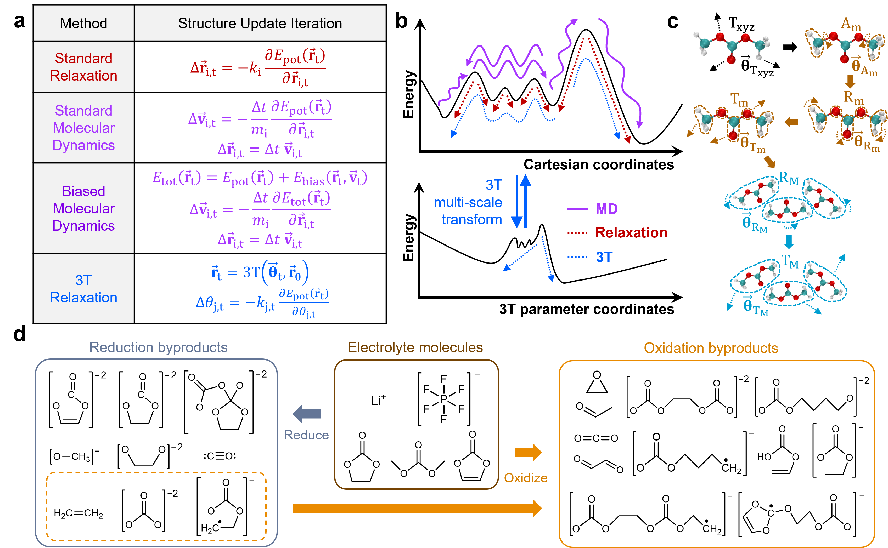

# External 3T

This repository accompanies the paper publication <b>3T-VASP: Fast Ab-initio Electrochemical Reactor via Multi-Scale Gradient Energy Minimization</b> by <b>J.P. Mailoa, X. Li, and S. Zhang</b> at Nature Communications. <br />
Related links: <br />
&ensp;Publication link:  <br />
&ensp;CodeOcean compute capsule: [](https://codeocean.com/capsule/9554531/tree/v1) <br /> 
&ensp;Zenodo Github v1.0.0 snapshot: [](https://doi.org/10.5281/zenodo.13895562) <br />



This repository allows the usage of 3T structure optimization / energy minimization algorithm on solid surface/liquid (multi molecule) interface. Depending on your system setup, this can effectively be used for bulk liquid system as well. The 3T structure transformation is performed within PyTorch, while the structure energy evaluation is done using an external software outside of PyTorch such as VASP, etc. In fact we also use PyTorch as an 'external calculator' to calculate classical force field energy in this repository.

Follow the instructions below to run example code. The raw and source data related to the manuscript publication can be found in the `paper_resources` folder.

Another example on how to couple the 3T optimizer with other ab-initio ASE calculators such as NWChem (3T-NWChem) is available in the `Simple_3T` folder.

## Quick Start

### Install Conda Dependencies
Start by setting up your conda environment and Python dependencies:
```
conda create --name 3T python=3.8
conda activate 3T
conda install --file requirements.txt -c pytorch -c conda-forge -c rdkit
```
<b>Install the conda dependencies separately if necessary. </b>

### Install Gromacs
In addition to the python dependencies in `requirements.txt`, you should also ensure that Gromacs is properly installed. We suggest installing gromacs from source. For example, follow these download and installation instructions: <br />
&ensp;https://manual.gromacs.org/documentation/2021.3/download.html <br />
&ensp;https://manual.gromacs.org/2021.3/install-guide/index.html  <br />
Or on CentOS, simply do: <br />
```
yum -y install gromacs
```

### Ensure Correct `python` Command
Ensure that the command `python` refers to the python library of your conda environment. This is not always the case. For example, this may not be true in centOS image in Tencent Cloud with VASP installed. In my case, I need to do:
```
conda activate 3T
alias python='/opt/intel/oneapi/intelpython/latest/envs/3T/bin/python3.8'
```

### Install Modified Version of InterMol
Finally, after installing these python libraries and Gromacs, you should install the Gromacs-LAMMPS file format converter. The InterMol library is taken from the InterMol Github page https://github.com/shirtsgroup/InterMol, but has been modified to fix some bugs related to Gromacs-LAMMPS file conversion (so using the original Github's code with 3T won't work).<br />
If you are interested, the modification is primarily done in the `utils/Convert_Gromacs_LAMMPS/InterMol/intermol/gromacs/grofile_parser.py` file. <br />
Note that InterMol is only used for preparing new 3T molecule data `GL_data` object. <b>Because this 3T codebase uses molecule force field caching, you do not need InterMol if you are working with just old molecules that you have already cached in your database.</b> See `utils/process_molecule.py` function `convert_molecule`.
```
cd utils/Convert_Gromacs_LAMMPS/InterMol
python setup.py build
python setup.py install
cd ../../..
```

### Install and Integrate VASP
Assuming that you are using this codebase for its VASP-related functionalities, please ensure that your VASP installation is valid, and that the correct command is utilized in the file `utils/calculator_3T_VASP.py` function `run_VASP`. For Tencent TEFS VASP 6.2.1 system, the command we use to make external system call to the VASP software is:
```
os.system('nohup mpirun -n '+n_gpu+' --allow-run-as-root ~/software/vasp.6.2.1/bin/vasp_std')
```
Please change this Python system call into something specific to your VASP computing environment.

### Miscallenous
Please ensure that the following commands are valid inside your 3T conda environment: `gmx`, `wget`, `unzip`, and `packmol`.

### Test Run
At this point, you are ready to run a test example.

For paper example on bulk electrolyte reduction, run the command:
```
python randomize_3T_bulk_electrolyte_reduction.py
```

For paper example on bulk electrolyte oxidation, run the command:
```
python randomize_3T_bulk_electrolyte_oxidation.py
```

For trajectory analysis and result visualization of running results, please refer to the `Examples` folder.

## Tracking the progress
On a separate terminal, you can track the progress of the cycles by checking the content of the log file `default.log`, which is updated in real-time for both the classical force field and VASP components of the structure minimization.

## Contact

Questions about this repository may be addressed to Jonathan Mailoa ( jpmailoa [AT] alum [DOT] mit [DOT] edu ).
